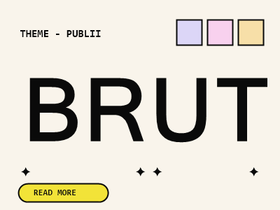

# Brut — a Publii theme

A bold, brutalist blog theme for [Publii](https://getpublii.com), the privacy-focused static site CMS.

Cream paper background, giant condensed uppercase titles, monospace labels, pastel cards, pill buttons and a pitch-black footer — with a warm dark mode built in.



## Features

- **Light & dark mode** — pick light, dark, or auto (follows the visitor's system preference), plus an optional one-click toggle in the header. The visitor's choice is remembered. No flash of the wrong scheme on load.
- **Zero external requests** — no web fonts, no CDN, no analytics. System font stacks only (condensed grotesque + monospace). Perfect fit for Publii's privacy-first philosophy.
- **Fully configurable from the Publii UI** — colors for both schemes (cream, ink, accent, three pastels), hero texts, all interface labels (easy to translate to any language), date format, uppercase titles toggle.
- **Comfortable reading** — fluid type scale, generous line-height and spacing, reduced-motion support, visible focus outlines.
- **Modern Publii support** — pages, posts page, tag pages + tags list, author pages, 404, RSS/JSON feeds, block editor, responsive images, comments custom code.
- **Two menus** — pill buttons in the header (with dropdown submenus), monospace link list in the black footer.
- **Feature card** — the latest post can be highlighted as a big pastel card on the front page.
- **Custom editor elements** — black marker highlight, mono label, three pastel boxes, big statement paragraph.
- **Lightweight** — a single CSS file, ~50 lines of vanilla JS (scheme toggle, menu toggle, footer clock). No jQuery, no build step.

## Installation

### From a release zip

1. Download the latest `brut.zip` from the [Releases](../../releases) page.
2. In Publii, go to **Themes** (left sidebar) → **Install theme** and select the zip.
3. Select **Brut** as your site theme, then customize it in **Theme settings**.

### From source

Clone this repository into Publii's themes directory, then restart Publii:

```
# Windows
git clone https://github.com/Simon256px/publii-theme-brut "%USERPROFILE%\Documents\Publii\themes\brut"

# macOS / Linux
git clone https://github.com/Simon256px/publii-theme-brut ~/Documents/Publii/themes/brut
```

## Theme settings overview

| Group | What you can change |
|---|---|
| Hero | Kicker line, big title, intro text, feature-card toggle |
| Colors | Color scheme (light / dark / auto), header toggle on/off, light & dark backgrounds and inks, accent, pastel 1–3 |
| Typography | Uppercase titles on/off, min/max root font size |
| Footer | Copyright text, live clock label (e.g. `PARIS`), back-to-top |
| Labels | Every interface string (Read, Older, Newer, Tags…) — translate the theme in one minute |
| Additional | Date format, favicon |

## Tips

- **Hero intro**: wrap a sentence in *italic* (`<em>`) to render it in a muted gray.
- **Marker highlight**: in the editor, apply the *Marker (black highlight)* custom element to a paragraph for the marker-pen label effect (it inverts automatically in dark mode).
- **Footer links**: add external links to the *Footer menu*; items opening in a new tab automatically get a ↗ arrow.

## En français

Brut est un thème de blog brutaliste pour [Publii](https://getpublii.com) : fond crème, titres condensés géants, étiquettes monospace, cartes pastel — et un mode sombre intégré (clair / sombre / auto + bouton de bascule dans l'en-tête). Tous les textes de l'interface (« Read », « Older », etc.) se traduisent directement dans **Réglages du thème → Labels**, sans toucher au code. Aucune requête externe : pas de polices web, pas de CDN.

## License

[MIT](LICENSE) — © 2026 Simon Courtois.
